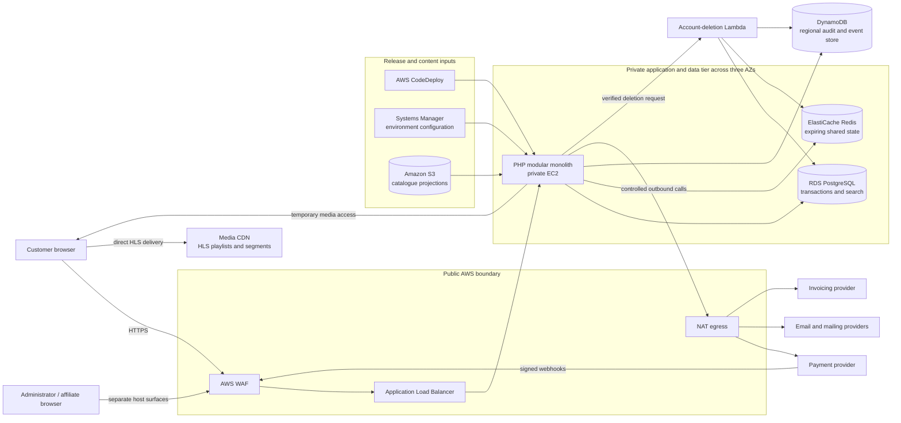

# Subscription Video Platform

## Backend & AWS Engineering Case Study

Architecture · Payments · Data Systems · Serverless Workflows · Security · Cloud Cost Optimization

## Overview

The platform combines a PHP application on private EC2, PostgreSQL, Redis, DynamoDB, S3-backed catalogue projections, hosted payment and invoicing providers, and CDN-delivered adaptive video. Its hardest engineering work sits at the boundaries: translating provider events into reliable entitlements, protecting paid media without turning EC2 into a video proxy, maintaining revocable identity state, and separating relational transactions from short-lived or event-shaped data.

## The system in one minute

1. Customer, administrator, and affiliate requests enter through AWS WAF and an Application Load Balancer.
2. A host-aware PHP modular monolith runs on private EC2. Route registries select the product surface and attach authentication and database policies.
3. RDS PostgreSQL owns transactional business state and catalogue search. Redis owns expiring security and checkout state. DynamoDB stores keyed audit, consent, suppression, and event records.
4. Stripe collects payment details. Signed, deduplicated webhooks update subscriptions, one-time purchases, entitlements, and affiliate records.
5. After an entitlement check, the backend returns a short-lived signed media URL. The browser streams HLS playlists and segments directly from the CDN.
6. CodeDeploy promotes versioned releases through an atomic symlink, loads environment configuration from Systems Manager, synchronizes catalogue projections from S3, reloads Apache, and validates a local health endpoint.
7. Account deletion is isolated in a Lambda workflow because it coordinates revocation and deletion across PostgreSQL, Redis, DynamoDB, the payment provider, and the mailing provider.

## Architecture at a glance

The design is deliberately hybrid. A cohesive interactive workload remains on persistent compute, while a bounded multi-system compliance operation runs in Lambda. Each store has a narrow responsibility rather than being used as a universal database.

## Engineering work that matters

### Provider events become local access rights

The browser return from checkout is not proof of payment. The backend verifies webhook signatures, claims events idempotently, and applies subscription or one-time-purchase changes inside PostgreSQL transactions. Redis carries short-lived checkout state; DynamoDB records legal-consent evidence; invoicing and mailing integrations run around the authoritative payment transition.

[Payments and subscriptions →](docs/payments-subscriptions.md)

### Paid media bypasses application bandwidth

PHP remains the authorization point but not the media transport. It validates a local entitlement and returns temporary CDN access; the player then fetches adaptive HLS content directly. This keeps long-lived connections and segment bandwidth away from EC2.

[Media delivery →](docs/media-delivery.md)

### Search stays inside PostgreSQL

Catalogue search combines weighted PostgreSQL full-text search, fuzzy similarity, bounded result windows, and deterministic ordering. OpenSearch is installed as a dependency but is not used at runtime; catalogue search remains in PostgreSQL.

[Data architecture →](docs/data-architecture.md)

### Identity is revocable and operationally bounded

Authentication uses short-lived JWT sessions with rotation and server-side revocation. Redis also implements OTP expiry, resend cooldowns, attempt limits, abuse counters, and provider-spend budgets.

[Identity and device access →](docs/identity-device-access.md)

### Account deletion crosses system boundaries

A verified deletion request invokes a Lambda workflow that revokes shared session state, removes or anonymizes relational records, cleans keyed audit data, coordinates provider cleanup, and writes a pseudonymous completion record. Isolation keeps a rare, failure-prone compliance workflow out of the normal request core.

[Event-driven and serverless architecture →](docs/event-driven-architecture.md)

### Deployments are versioned and host-driven

CodeDeploy creates a versioned release, loads encrypted configuration, fetches environment-specific S3 data, switches the application symlink atomically, reloads Apache, and polls a local health route. Deployment automation begins with the CodeDeploy artifact; upstream artifact creation is a separate pipeline boundary.

[CI/CD and production operations →](docs/ci-cd-production.md)

## Technology overview

| Area | Confirmed technology | Responsibility |
|---|---|---|
| Application | PHP, Apache, custom MVC/router | Customer, administrator, affiliate, and API surfaces |
| Browser UI | React, server-rendered PHP views, Babel build | Interactive web experience |
| Relational data | Amazon RDS for PostgreSQL, PDO | Accounts, catalogue, payments, entitlements, support, attribution |
| Search | PostgreSQL full-text search and similarity | Multi-entity catalogue search |
| Shared ephemeral state | Amazon ElastiCache for Redis | Session revocation, OTP controls, checkout and consent staging |
| Event-shaped records | Amazon DynamoDB | Consent, login audit, email events, suppression, feedback, privacy audit |
| Object data | Amazon S3 | Deploy-time catalogue and commercial configuration |
| Compute | Private Amazon EC2 and AWS Lambda | Interactive application and isolated account deletion |
| Delivery | AWS WAF, ALB, NAT, external media CDN | Ingress, controlled egress, direct HLS delivery |
| Payments | Stripe Checkout, customer portal, signed webhooks | Recurring and one-time payment lifecycle |
| Invoicing | Hosted invoicing API, AWS Secrets Manager | Invoice generation and credential lifecycle |
| Email | PHPMailer plus email and mailing providers | OTP, transactional messages, lifecycle synchronization |
| Delivery automation | AWS CodeDeploy, Systems Manager, S3, IMDSv2 | Versioned releases and environment configuration |
| Tests | PHPUnit 10, 524 test methods in source | Controllers, models, security helpers, providers, deployment-adjacent logic |

## Key decisions and trade-offs

| Decision | Why it fit | Cost or limitation accepted |
|---|---|---|
| Modular monolith on private EC2 | Cohesive synchronous workload and shared transactions | Fixed compute floor and coupled release |
| PostgreSQL-native search | Avoids a separate always-on search cluster | Search consumes relational capacity |
| Redis for expiring coordination | Fast shared revocation, OTP, and checkout state | Redis becomes critical to authentication and checkout |
| DynamoDB for irregular keyed records | Independent retention and serverless-friendly access | Cross-store consistency is explicit, not transactional |
| S3-published JSON catalogue | Cheap, fast browse projection | Publication and database state can temporarily diverge |
| Webhook-owned entitlement | Provider truth is processed idempotently | Requires replay-safe reconciliation |
| Direct signed HLS delivery | Removes media bytes from application compute | CDN policy is a security dependency |
| Lambda for account deletion | Isolates a rare multi-system workflow | Partial failure and retry semantics need care |
| Versioned symlink deployment | Fast atomic application switch | Current hooks need a fail-closed environment selection |

## Deep dives

- [Overall architecture](docs/architecture.md)
- [Data architecture](docs/data-architecture.md)
- [Identity and device access](docs/identity-device-access.md)
- [Media delivery](docs/media-delivery.md)
- [Payments and subscriptions](docs/payments-subscriptions.md)
- [Event-driven and serverless architecture](docs/event-driven-architecture.md)
- [Affiliate and support operations](docs/affiliate-support-operations.md)
- [Security architecture](docs/security-architecture.md)
- [AWS cost optimization](docs/cost-optimization.md)
- [CI/CD and production operations](docs/ci-cd-production.md)
- [Engineering decisions](docs/engineering-decisions.md)

## Architecture diagrams

- [High-level architecture](diagrams/high-level-architecture.md)
- [Network and security architecture](diagrams/network-architecture.md)
- [Request routing](diagrams/request-routing.md)
- [Media access flow](diagrams/media-access-flow.md)
- [Payment lifecycle](diagrams/payment-lifecycle.md)
- [Identity and device flow](diagrams/identity-device-flow.md)
- [Account-deletion flow](diagrams/account-deletion-flow.md)
