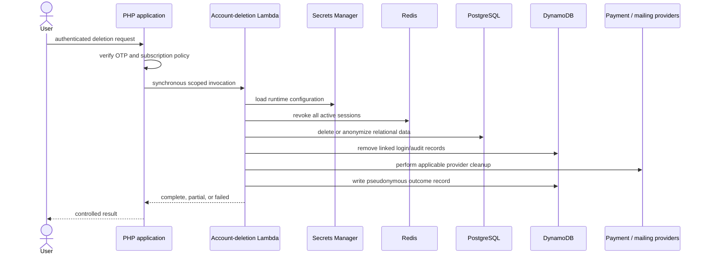

# Account-Deletion Flow

The workflow is isolated because it is rare, permission-sensitive, and spans systems that cannot share a transaction. Revocation happens early; partial completion remains visible for investigation and retry.

[Back to README](../README.md)
