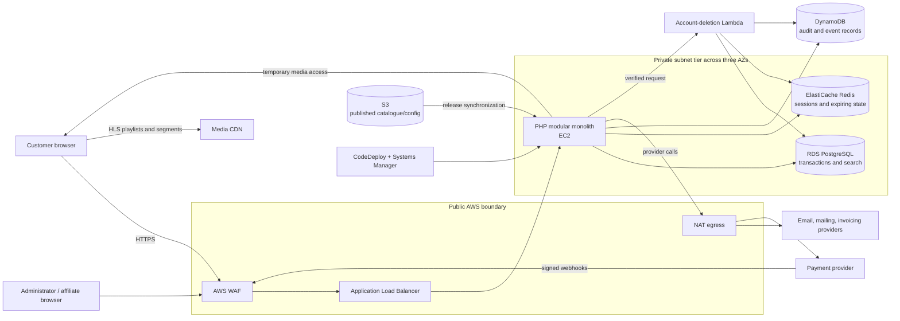

# High-Level Architecture

The interactive application remains one cohesive deployment. Specialized services are used for concrete access patterns: relational transactions, expiring coordination, event-shaped records, object publication, isolated compliance work, and direct media delivery.

[Back to README](../README.md)
