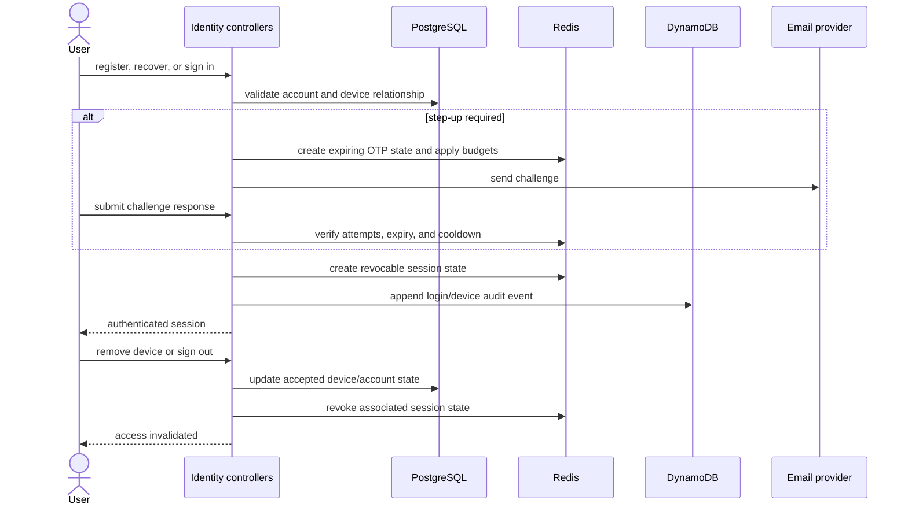

# Identity and Device Flow

```mermaid
sequenceDiagram
    actor User
    participant App as Identity controllers
    participant PG as PostgreSQL
    participant R as Redis
    participant DDB as DynamoDB
    participant Mail as Email provider

    User->>App: register, recover, or sign in
    App->>PG: validate account and device relationship
    alt step-up required
        App->>R: create expiring OTP state and apply budgets
        App->>Mail: send challenge
        User->>App: submit challenge response
        App->>R: verify attempts, expiry, and cooldown
    end
    App->>R: create revocable session state
    App->>DDB: append login/device audit event
    App-->>User: authenticated session

    User->>App: remove device or sign out
    App->>PG: update accepted device/account state
    App->>R: revoke associated session state
    App-->>User: access invalidated
```

PostgreSQL owns the account relationship, Redis owns short-lived coordination and revocation, and DynamoDB stores audit-shaped events.

[Back to README](../README.md)
