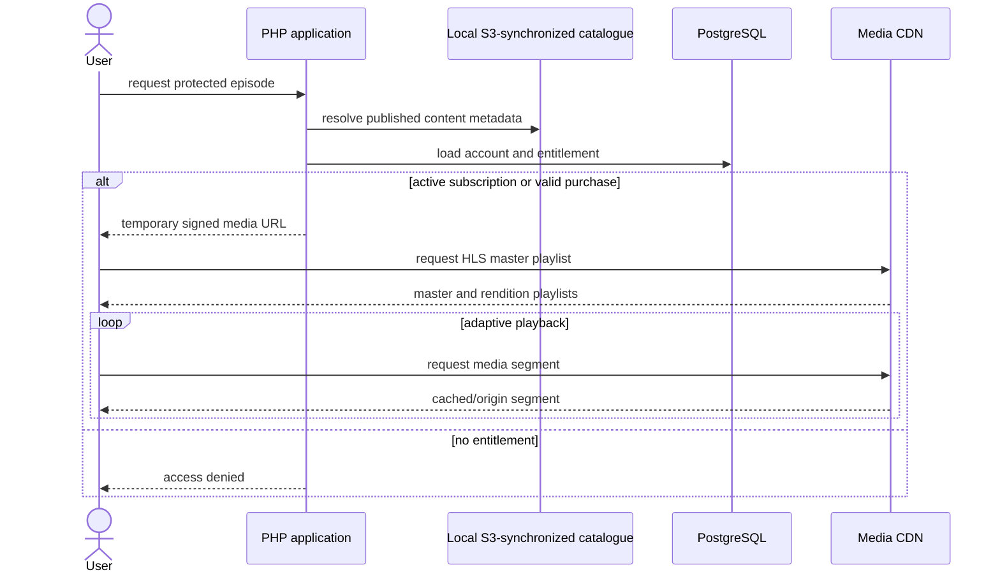

# Media Access Flow

The application makes the access decision once and then leaves the media transfer path. Catalogue publication, entitlement, and CDN delivery remain distinct failure and observability boundaries.

[Back to README](../README.md)
