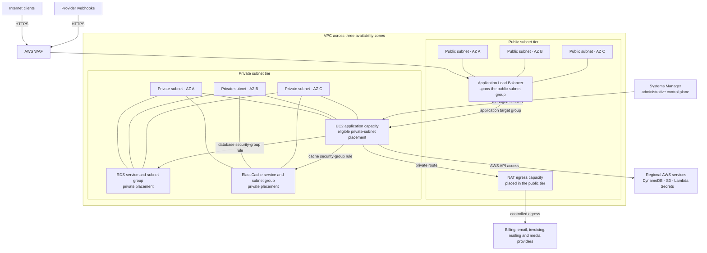

# Network and Security Architecture

## How to read this diagram

There are three public and three private subnets, distributed across availability zones. The ALB spans the public subnet group. Application compute and private managed data services use the private subnet group; NAT supplies outbound connectivity from private routes.

The connections to all three private subnets describe eligible placement, not one copy of each service in every subnet. EC2, RDS, ElastiCache, and NAT availability-zone placement is determined by deployment and managed-service configuration.

## Security boundaries

- WAF and the ALB are the public application boundary.
- EC2 has no direct client ingress path.
- PostgreSQL and Redis accept only the required application security-group relationships.
- Systems Manager provides administrative access without a public SSH route.
- NAT supplies controlled outbound connectivity for external providers.
- DynamoDB, S3, Lambda, and Secrets Manager are regional AWS services, not resources placed inside one application subnet.

[Back to README](../README.md)

