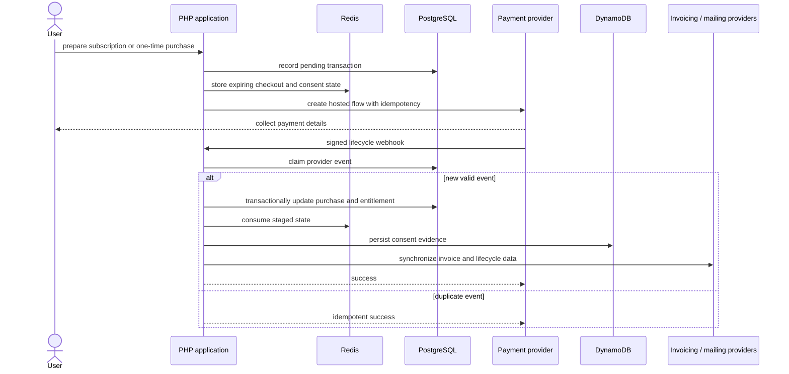

# Payment Lifecycle

The signed provider event, not the browser return, controls local access. PostgreSQL is authoritative; Redis and DynamoDB support different retention and workflow needs around that transition.

[Back to README](../README.md)
