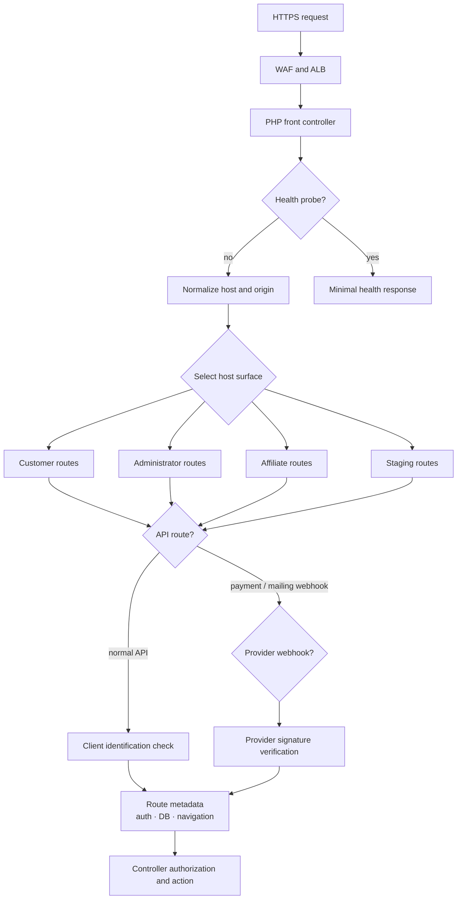

# Request Routing

Host-aware registries allow several product surfaces to share one deployment. The browser API key identifies an expected client but is not an authorization boundary. Provider webhooks authenticate through their own signatures, and sensitive controllers apply ownership, role, or entitlement checks after routing.

[Back to README](../README.md)
