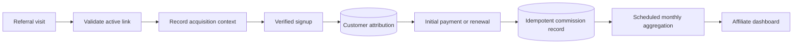

# Affiliate and Support Operations

## Why these subsystems matter

Affiliate attribution and customer support connect acquisition, verified signup, billing, entitlement, and operator workflows to the same relational system. They show how operational work remains traceable without creating a service for every back-office function.

## Affiliate lifecycle

### Referral capture

The signup path validates the referral before preserving first-party attribution context. Invalid references do not block account creation.

After email verification, the backend attaches an active affiliate relationship only if the customer has no existing attribution. Conflict-safe insertion makes repeated signup requests preserve the first accepted attribution rather than silently reassigning it.

### Commission creation

Payment events read the saved relationship and insert the corresponding accounting record. Initial activation and renewal are distinct cases. A unique provider invoice/event identity prevents webhook retry from producing duplicate commission entries.

The payment domain currently performs the commission calculation because transaction and entitlement state already move together there. A separate ledger becomes justified when reversals, payout approval, multiple currencies, or multiple acquisition channels become material.

### Reporting

The dashboard reads bounded monthly aggregates. The production workload inventory includes a scheduled serverless aggregation task; its implementation is deployed separately from the PHP application. PostgreSQL remains the reporting source consumed by the dashboard.

## Customer-support workflow

Customers can create a support case, list their cases, open an ordered conversation, and add messages. Operators use a separate administrator surface to inspect queues, reply, and update status.

PostgreSQL separates the case from its messages. Ordered reads reconstruct the conversation; multi-step operator updates use transactions where status and reply must change together.

### Authorization boundary

Customer reads verify that the requested case belongs to the authenticated account. Administrator operations use the separate operator identity surface, and the server derives the operator identity rather than accepting it from a request payload.

Ownership rules should live in a shared repository/service method used by every customer read and write. This reduces the risk that route metadata authenticates a caller but one controller forgets resource ownership.

## Data and operational trade-offs

### Relational cohesion

Attribution, billing, commission, and support records share PostgreSQL. This permits direct reconciliation and transaction references. Independent services and databases would add event contracts and failure modes without solving a measured scaling problem.

### Event and retention data

Login audit, feedback, waiting-list, and mailing-provider events use DynamoDB rather than expanding the relational business schema. Retention can then follow the event class, including TTL-based expiry where applicable.

### Synchronous versus scheduled work

Attribution capture and commission creation occur on the request or verified webhook path because they need immediate correlation. Monthly aggregation is scheduled because no customer request should pay its compute cost.

## Scale evolution

At higher volume, the next changes would be:

1. a durable webhook inbox and billing worker;
2. an explicit affiliate ledger with reversal and payout states;
3. reproducible aggregate rebuilds from ledger records;
4. centralized support ownership checks;
5. cursor pagination and indexes based on operator query patterns;
6. explicit retention and access-audit policy per data class.

[Back to README](../README.md)
