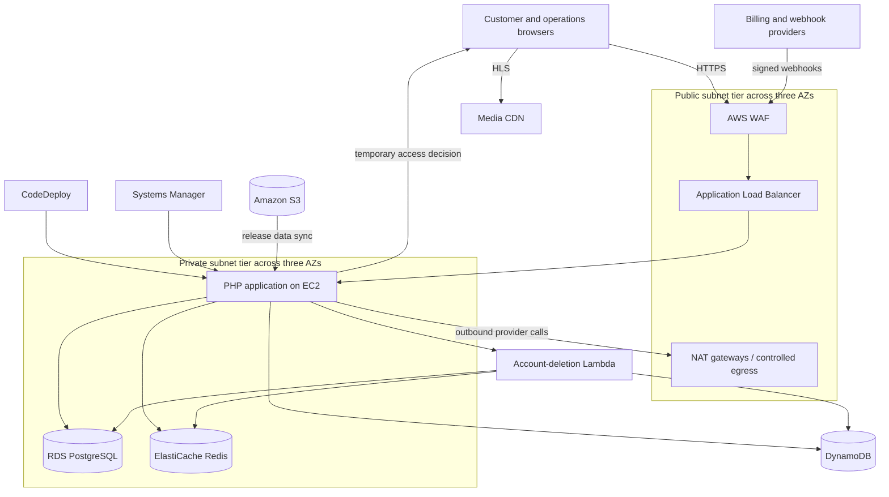

# System Architecture

## Architectural shape

The platform is a host-aware PHP modular monolith deployed on private EC2. Customer pages, JSON APIs, administrator tools, affiliate operations, catalogue access, payments, and support workflows share one release and one relational model. This is a deliberate transaction and operations boundary: the modules frequently coordinate on accounts, entitlements, purchases, and attribution.

The architecture is hybrid rather than uniformly serverless. The interactive request core stays on persistent compute. A rare account-deletion workflow runs in Lambda because it must coordinate cleanup across several systems and benefits from an isolated execution and permission boundary.

## Component status

| Component | Status | Confirmed responsibility |
|---|---|---|
| PHP application on EC2 | Active | Routing, server-rendered views, APIs, identity, catalogue, payments, support |
| RDS PostgreSQL | Active | Relational system of record and catalogue search |
| ElastiCache Redis | Active | Revocable sessions, OTP controls, short-lived checkout and consent state |
| DynamoDB | Active | Consent, login audit, email events, suppression, feedback, and privacy records |
| S3 | Active | Deployment-time catalogue and commercial configuration |
| CodeDeploy | Active | Versioned release installation and validation |
| Systems Manager Parameter Store | Active | Encrypted environment configuration during deployment |
| Secrets Manager | Active | Runtime credentials for isolated provider and deletion workflows |
| Account-deletion Lambda | Active | Multi-store revocation, deletion, anonymization, and audit |
| Stripe and invoicing/mailing providers | Active | Billing, invoice lifecycle, and communication synchronization |
| Media CDN | Active | HLS playlist and segment delivery after authorization |
| OpenSearch client package | Packaged but unused | Dependency installed; no runtime calls |
| EventBridge, SQS, Step Functions, WebSocket API | Not used by the application runtime | No active request-path integration |

## Topology

The private tier is a set of three subnets, one per availability zone. EC2 and private data services are attached to that tier according to their service configuration; the diagram does not imply that each service occupies a separate private network.

## Client and backend boundary

The browser owns presentation, interaction state, and media playback. It does not decide entitlement or payment success.

The backend owns:

- host and route selection;
- authentication and resource authorization;
- relational state transitions;
- checkout preparation and webhook reconciliation;
- temporary media authorization;
- provider orchestration;
- support and affiliate policy.

External providers own card collection, invoice delivery, mailing-list delivery, and media-byte delivery. Keeping these boundaries explicit reduces regulated-data handling and prevents PHP from becoming a bandwidth proxy.

## Request routing

The front controller loads configuration, normalizes the request host and origin, applies CORS policy, handles maintenance mode, and dispatches through separate route registries. The registries describe the controller, method, authentication requirement, navigation mode, and whether a database connection is required.

Four main surfaces share the release:

- customer website and account area;
- versioned customer API;
- administrator console and API;
- affiliate console and API.

This reduces deployment units but raises the value of route-policy tests. Authorization is enforced again in controllers for sensitive resource ownership and role checks.

## Synchronous paths

### Catalogue and search

Browse pages read a deploy-time JSON projection. Search uses PostgreSQL full-text and fuzzy operators across episodes, modules, topics, and authors. Entitlement and favorites remain relational because they are user-specific transactional state.

### Authentication and OTP

Login validates account and device state, then creates a revocable session. Redis is consulted for refresh rotation and invalidation. OTP flows use Redis for expiry, cooldown, attempt limits, abuse counters, and provider-cost budgets.

### Billing

The application prepares checkout and records pending local state. Signed provider webhooks are the authoritative trigger for entitlement changes. Multi-row updates use PostgreSQL transactions and event claims make webhook retries safe.

### Media access

The backend resolves an episode, validates subscription or one-time-purchase entitlement, and generates temporary CDN access. The browser then leaves the application request path and fetches HLS directly from the CDN.

## Serverless and event-driven paths

The account-deletion controller requires an authenticated, OTP-verified request and prevents self-service deletion while a subscription is active. It then invokes Lambda synchronously and receives a structured result.

The Lambda:

1. loads its runtime configuration from managed secret storage;
2. revokes shared session state;
3. deletes or anonymizes relational records;
4. cleans associated DynamoDB login records;
5. coordinates payment-provider cleanup where applicable;
6. writes a pseudonymous privacy audit record.

Payment and mailing webhooks are also event-driven integrations, although they terminate in the EC2 application rather than an AWS event bus.

## Data and consistency boundaries

PostgreSQL transactions protect state that must move together: payment records, entitlement, purchases, and affiliate accounting. Redis and DynamoDB cannot participate in the same transaction.

The implementation therefore uses three patterns:

- idempotent event claims before replayable webhook work;
- expiring Redis snapshots for state needed only around checkout or verification;
- best-effort auxiliary writes where failure must not corrupt the authoritative relational transition.

This is practical for the current scale, but it leaves observable partial-failure cases. Critical cross-store workflows should expose reconciliation metrics and safe replay tools.

## Failure behavior

| Dependency failure | Expected effect |
|---|---|
| PostgreSQL | Most authenticated and commercial requests fail; connection retries and bounded timeouts limit hangs |
| Redis | Session validation, OTP, and checkout coordination are affected; fail-open behavior would be unsafe |
| DynamoDB | Audit or auxiliary event writes may fail while some relational operations can still complete |
| Billing provider | New checkout and reconciliation pause; existing local entitlement remains readable |
| Media CDN | Playback fails without consuming EC2 bandwidth |
| S3 during deployment | Catalogue/config synchronization fails and the release should not be promoted |
| Lambda during deletion | The request returns a partial or failed result for controlled retry and investigation |

## Scaling path

The current design favors a small operational surface. At materially higher scale, the first pressure points are likely to be relational search CPU, large webhook bursts, DynamoDB scan-based email lookups, and the coupled EC2 release.

Possible evolution should follow measured bottlenecks:

- introduce a search service only when PostgreSQL search competes with transactions;
- move webhook processing behind a durable queue when burst absorption and replay isolation are required;
- replace DynamoDB scans with indexed access patterns;
- separate deployment units only where ownership, scaling, or failure isolation justifies the operational cost.
