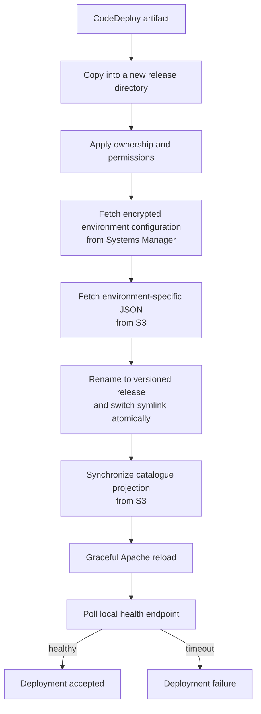

# CI/CD and Production Operations

## What the repository implements

The deployment package includes an AWS CodeDeploy AppSpec and host-side lifecycle hooks. It also contains pinned PHP and JavaScript lockfiles, frontend build scripts, PHPUnit configuration, and 524 test methods.

Deployment automation begins with a CodeDeploy artifact. Upstream build, identity-federation, branch-gate, and artifact-promotion workflows are separate from the host-side release lifecycle.

## Release lifecycle

### AfterInstall

1. CodeDeploy copies the artifact into a staging release directory.
2. A permissions hook assigns the web-server owner and restrictive file/directory modes.
3. The environment hook uses IMDSv2 to identify the instance region and deployment environment, then downloads encrypted configuration from Systems Manager.
4. A configuration hook fetches the matching offer/coupon JSON from S3.
5. The release is renamed with a timestamp and the live symlink is switched atomically.
6. Old releases are pruned to a bounded recent set.
7. Catalogue JSON is synchronized from S3 into the active release with timestamp comparison and deletion of removed objects.

### ApplicationStart and ValidateService

Apache receives a graceful reload. CodeDeploy then polls the application locally with a finite retry window.

There is a code-level mismatch risk between the deployment probe name and the early health-route aliases. The probe must be covered by a deployment test so that a healthy release cannot fail validation, and a generic page cannot accidentally satisfy the health check.

## Deployment properties

### Atomic code switch

The symlink change prevents the PHP process from seeing a directory while files are still being copied. A bounded set of prior releases remains on disk, which supports quick manual re-pointing and prevents unbounded storage growth.

### Configuration outside the artifact

Environment secrets are fetched at deployment and written with restricted permissions. Catalogue and commercial JSON are selected by environment from S3. The same artifact can therefore be promoted without embedding production configuration.

### Current rollback boundary

Recent releases remain available for recovery, but the hooks do not automatically restore the previous symlink after a failed post-switch synchronization or health check.

A safe next step is to capture the old target before promotion and restore it automatically on any later hook failure, followed by another local health check.

## Environment handling

Production and staging configuration are selected from an EC2 environment tag. The hooks use IMDSv2 and the instance role rather than embedding AWS credentials in deployment commands.

The current default for a missing or unrecognized environment tag is production. That is unsafe for deployment automation. Selection should be an allowlist and fail closed:

1. require the tag;
2. accept only known values;
3. verify the selected SSM parameter and S3 prefix;
4. stop before writing configuration when validation fails.

## Build and test surface

### PHP

Composer dependencies are pinned by a lockfile and include the AWS, payment, Redis, mail, OpenSearch-client, and invoicing libraries used or evaluated by the application. PHPUnit covers routing, controllers, models, DynamoDB behavior, payment lifecycle, mail webhooks, security helpers, and error paths.

The presence of tests is not the same as a release gate. The upstream CI system should execute:

- dependency installation from the lockfile;
- syntax and static analysis;
- PHPUnit with isolated provider doubles;
- route-policy and authorization-matrix tests;
- secret and dependency scanning;
- packaging from a clean workspace.

### Browser assets

The JavaScript package scripts clean and compile source assets and generate an asset manifest. Release packaging should include built artifacts, not development coverage output or duplicated source maps that are unnecessary at runtime.

## Monitoring and logging

The application uses internal logging and production-safe error responses. CloudWatch carries operational signals, while selected database audit events follow a separate archival delivery path.

The key service-level signals are:

| Area | Signals |
|---|---|
| Ingress/application | ALB errors, latency, WAF blocks, EC2 saturation, PHP error rate |
| PostgreSQL | connections, CPU, lock waits, statement timeouts, failover/retry rate |
| Redis | availability, memory, evictions, command latency, revocation failures |
| DynamoDB | throttling, consumed capacity, scan volume, failed audit writes |
| Payments | webhook age, duplicate rate, processing failures, entitlement divergence |
| Media | authorization failures, CDN errors, startup time, cache ratio, egress |
| Deployment | hook duration, S3/config failure, health timeout, active release identity |
| Privacy workflow | Lambda errors, duration, partial completion, retry age |

Logs should carry a correlation identifier and structured reason codes while redacting credentials, payment-sensitive values, temporary media URLs, and unnecessary personal data.

## Backup and recovery

The application code contains failure handling and bounded release retention, but database backup retention, point-in-time recovery settings, DynamoDB recovery settings, and restore-test cadence are infrastructure configuration not defined in this repository.

A complete production runbook should specify:

- RDS automated backup and point-in-time recovery policy;
- DynamoDB recovery/retention per table class;
- versioning/retention for S3 publication objects;
- restore validation in a non-production environment;
- recovery objectives for entitlement, audit, and catalogue data.

## Recommended pipeline

```mermaid
flowchart LR
    Commit["Commit"]
    Validate["Lint · static analysis · PHPUnit"]
    Scan["Secret · dependency · policy scans"]
    Build["Reproducible artifact"]
    Stage["Deploy staging"]
    Verify["Smoke and integration checks"]
    Approve["Production approval"]
    Deploy["CodeDeploy production"]
    Observe["Health and business metrics"]

    Commit --> Validate --> Scan --> Build --> Stage --> Verify --> Approve --> Deploy --> Observe
```

This is the pipeline contract the repository should enforce around the implemented CodeDeploy lifecycle. It is not presented as an already committed GitHub workflow.

[Back to README](../README.md)
