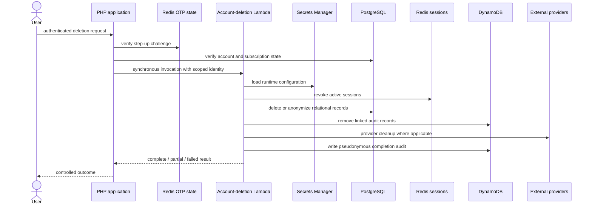

# Event-Driven and Serverless Architecture

## Where events are used

The platform does not treat serverless as a replacement for the application. Events and Lambda are used where the trigger, scaling shape, or permission boundary differs from interactive HTTP work.

There are three event classes:

1. signed commercial and mailing webhooks handled by the EC2 application;
2. a request-triggered Lambda for multi-system account deletion;
3. production support workloads for catalogue publication, media synchronization, scheduled reporting, and database-audit processing.

## Workload map

| Workload | Runtime | Status |
|---|---|---|
| Payment and mailing webhooks | PHP on EC2 | Implemented in application source |
| Account deletion | AWS Lambda, invoked by PHP | Lambda source and invocation path present |
| Catalogue JSON publication | Lambda to S3 | Production workload inventory; implementation outside this repository |
| Media object synchronization | S3-triggered Lambda | Production workload inventory; implementation outside this repository |
| Affiliate monthly aggregation | Scheduled Lambda | Production workload inventory; implementation outside this repository |
| Database audit-log filtering/archive | CloudWatch/Lambda delivery path | Production workload inventory; implementation outside this repository |
| EventBridge, SQS, Step Functions | — | No active application implementation found |

Separately deployed workloads are described by their trigger, responsibility, and integration boundary; runtime policies belong to their deployment units.

## Account-deletion workflow

### Why Lambda fits

Account deletion is rare, security-sensitive, and touches several independent systems. Isolating it provides:

- a dedicated IAM and secret boundary;
- no permanent worker process for an infrequent workload;
- independent timeout, logging, and failure classification;
- a smaller execution surface than embedding every provider cleanup path in a controller.

The invocation is synchronous because the user-facing operation needs an immediate structured result. It is serverless, but not asynchronous.

### Ordering and partial failure

The Lambda revokes shared session state early, then handles relational deletion/anonymization, DynamoDB cleanup, and provider operations. Auxiliary failures use controlled savepoints or best-effort handling. A final audit records the outcome without pretending that multiple stores committed atomically.

At higher volume or under stricter completion guarantees, this would evolve into a persisted deletion request and resumable state machine. The current design is simpler and suitable for an infrequent workflow, but it needs alerting and an operator retry path for partial results.

## Webhook-driven business state

Payment and mailing providers push signed events to public endpoints behind WAF/ALB. These are event-driven flows even though they execute on EC2.

Payment events have stronger correctness requirements:

- verify provider origin;
- claim the event idempotently;
- update authoritative relational state in a transaction;
- make secondary consent, invoice, mailing, and affiliate effects replay-safe.

Moving the endpoint to Lambda would not remove those requirements. The principal scaling improvement would be a durable inbox/queue separating acceptance from processing when webhook bursts or provider timeouts justify it.

## Catalogue and media publication

Catalogue browse projections are published to S3 and synchronized into the active release. Separate Lambda workflows generate catalogue projections and synchronize media objects outside the interactive request path.

This is a good event boundary because publication is triggered by content changes, not customer requests. It removes expensive transformation from the interactive path and lets S3 act as the durable handoff between producer and consumer.

## Scheduled operational work

Affiliate monthly aggregates are consumed by the application dashboard but produced by a scheduled serverless task. Computing aggregates on a schedule avoids repeating the work for each dashboard request.

Database audit events also follow a separate logging/delivery path so compliance retention does not depend on the availability of the web application.

## Why the interactive core remains on EC2

Customer, administrator, billing, catalogue, and support routes are frequent short requests that share:

- one PHP runtime and release;
- PostgreSQL connections and transactions;
- Redis session state;
- common routing and authorization;
- provider clients and server-rendered views.

Running the whole application as independent functions would add packaging, cold-start, connection, observability, and deployment boundaries without eliminating the relational coupling. Persistent EC2 gives a predictable fixed-cost floor and a simpler operational model for the observed workload.

## Trade-offs

| Choice | Benefit | Cost |
|---|---|---|
| Webhooks on EC2 | Reuses application transaction code | Provider bursts share web capacity |
| Synchronous deletion Lambda | Immediate structured result and isolated permissions | Caller waits; long cleanup can approach timeout |
| S3 publication handoff | Durable, inexpensive, decoupled | Eventual consistency between projections |
| Scheduled aggregation | Removes repeated dashboard compute | Report freshness follows schedule |
| Persistent request core | Simple cohesive deployment | Fixed compute and scaling unit |

[Back to README](../README.md)
