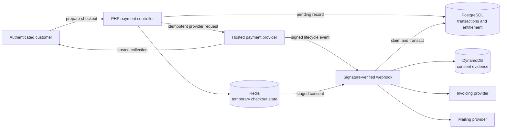

# Payments and Subscriptions

## Responsibility split

The platform supports recurring subscriptions and one-time purchases of individual content units. Responsibilities are intentionally divided:

| System | Responsibility |
|---|---|
| Payment provider | Card collection, payment intent, subscription, hosted account-management flows |
| PostgreSQL | Pending transactions, purchases, local entitlement, event claims, affiliate accounting |
| Redis | Short-lived checkout tokens, one-time state, consent staging |
| DynamoDB | Time-bound and durable legal-consent evidence |
| Invoicing provider | Invoice creation and electronic delivery workflow |
| Mailing provider | Lifecycle audience synchronization |

The application never treats a browser redirect as proof of payment. Provider webhooks are the authoritative transition into paid local entitlement.

## End-to-end flow

## Checkout preparation

The controller validates authentication, product or plan identity, ownership, existing entitlement, and commercial configuration. It creates or retrieves the provider customer and records pending local state before returning the hosted checkout information.

Redis tokens bind short-lived checkout state to the authenticated account and are consumed once. Provider idempotency keys protect repeated subscription-creation requests where the same browser action is retried.

The pre-inserted PostgreSQL transaction gives the later webhook a local correlation point and separates checkout intent from successful payment.

## Webhook trust and idempotency

The webhook endpoint is public by necessity. It validates the raw payload with the provider signature before business dispatch. It handles the major lifecycle categories:

- checkout completion;
- paid and failed invoices;
- subscription changes and deletion;
- payment-intent success or cancellation;
- setup-intent completion.

Event processing claims a provider event in PostgreSQL using uniqueness/conflict handling. Repeated delivery returns through the idempotent path instead of creating duplicate state. One-time purchases and affiliate commissions have additional conflict-safe writes tied to provider identities.

## Relational state transitions

### Initial subscription activation

The handler converts pending state into an active provider-backed transaction, updates local entitlement, and records affiliate accounting when attribution applies. Related rows are updated inside a PostgreSQL transaction.

### Renewal, failure, and cancellation

Paid invoices extend or restore local entitlement. Failed invoices and deleted or changed subscriptions map the provider state into explicit local statuses. Customer portal, cancellation, reactivation, and payment-method changes remain provider-hosted while the application reconciles the results.

### One-time purchase

A one-time payment is correlated with a content target. Successful provider events create a conflict-safe purchase record. Media authorization accepts either an active subscription or a valid purchase for the requested episode/module.

## Consent evidence

The checkout confirmation step creates a short-lived consent snapshot in Redis. After the authoritative provider event arrives, the application persists:

- time-bound raw evidence with TTL where required;
- longer-lived pseudonymous evidence for durable proof.

This split avoids retaining directly identifying evidence longer than the implementation requires, while preventing a slow or abandoned checkout from immediately creating a permanent audit record.

## Invoicing and mailing side effects

Invoice data is assembled from successful commercial state and sent through a dedicated provider service. That service retrieves its provider credentials from AWS Secrets Manager and manages credential refresh without storing secrets in source.

Mailing-list lifecycle changes are synchronized around subscription activation and cancellation. These integrations do not replace PostgreSQL as the entitlement authority. Provider failure must be visible and retryable without replaying the paid-access transition.

## Consistency and failure model

| Failure | Result |
|---|---|
| Invalid webhook signature or payload | Rejected before mutation |
| Duplicate provider event | Idempotent success without duplicate business write |
| PostgreSQL transaction failure | Rollback; provider retry can replay |
| Browser never returns | Signed webhook can still activate entitlement |
| Redis checkout state missing | Confirmation cannot safely reuse the expired/consumed state |
| DynamoDB evidence write fails | Relational payment can exist without its auxiliary evidence; alert/reconciliation required |
| Invoice or mailing API fails | Paid entitlement remains authoritative; side effect needs controlled retry |

The cross-store workflow is not one distributed transaction. Correctness comes from an authoritative relational transition, idempotent provider events, expiring workflow state, and observable auxiliary failures.

## Why hosted payment surfaces

Hosted checkout and account-management flows reduce the amount of payment-sensitive UI and card handling inside the application. The cost is provider dependency, webhook complexity, and the need for explicit reconciliation between provider and local states.

## Operational improvements at higher volume

- move verified webhooks into a durable inbox and worker when burst absorption is required;
- add a scheduled provider-to-local reconciliation report;
- expose metrics for event age, retry count, invoice failures, and entitlement divergence;
- persist explicit retry state for invoicing and mailing side effects;
- test concurrent duplicate delivery, not only sequential retry;
- separate the growing payment controller into checkout, webhook, entitlement, invoice, and provider adapters.

[Back to README](../README.md)
