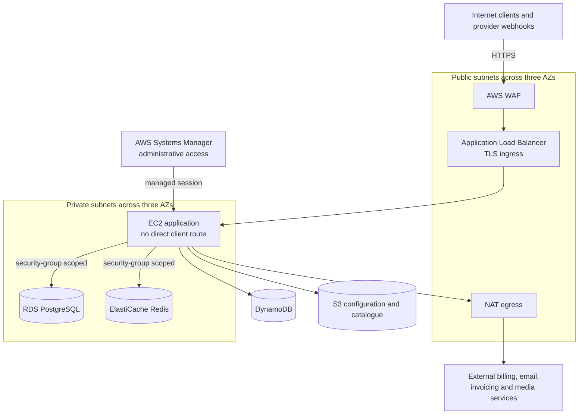

# Security Architecture

## Security model

Security is layered across network placement, request validation, identity state, resource authorization, provider verification, and managed configuration. The important property is that no single client-provided value grants access by itself.

## Infrastructure and network security

The public tier contains the ingress and outbound network components. Application instances and private managed data services attach to the three-subnet private tier across availability zones. RDS and Redis have no browser-facing route; their security groups admit only the required application relationships.

Administrative access uses Systems Manager rather than exposing an application-server SSH endpoint. Outbound provider calls leave through controlled NAT egress.

## Application security

### Host and route policy

The front controller normalizes the host and origin, applies an allowlist-based CORS policy, and selects a dedicated route registry for customer, administrator, affiliate, and staging surfaces. Route metadata declares authentication and database requirements.

Sensitive controllers perform resource checks in addition to route-level authentication. Examples include support-ticket ownership, subscriber media entitlement, operator identity derived from server state, and payment-customer ownership.

### Authentication and revocation

The platform uses short-lived JWT access sessions, refresh rotation, and server-side Redis validation and revocation. Customer, administrator, and affiliate contexts use separate namespaces and entry points.

This is intentionally not a fully stateless design. Logout, device removal, account changes, and account deletion need immediate invalidation before credential expiry. Redis provides that shared decision point.

### OTP and abuse controls

OTP flows use cryptographically generated challenges with server-side verification state. Redis enforces:

- expiration and resend cooldowns;
- failed-attempt lockouts;
- per-user and network-origin counters;
- channel and global volume bounds;
- daily provider-cost budgets and alert throttling.

These controls protect both account integrity and the economic abuse surface of paid messaging.

### API keys

The browser API key is treated as client identification and traffic classification, not as a secret or authentication boundary. Protected actions require authenticated identity and server-side authorization.

### Webhooks

Payment and mailing-provider webhook routes bypass the generic browser API-key check because they have their own cryptographic signature verification. Payload validity is checked before state mutation.

Payment events are also claimed idempotently in PostgreSQL. A valid signature proves provider origin; idempotency prevents a replayed valid event from applying the business transition twice.

### Input and output boundaries

The implementation uses prepared SQL statements, route/path sanitization, view traversal guards, origin normalization, and bounded search parameters. Production error display is disabled while internal logs retain diagnostic detail.

## Secret and access management

Deployment configuration is loaded from encrypted Systems Manager parameters into the release with restricted filesystem permissions and web access denied. The invoicing integration and account-deletion Lambda obtain provider credentials from Secrets Manager. EC2 deployment scripts use instance metadata and AWS CLI calls, which implies an instance role for SSM, S3, tagging, and deployment-time access.

One active DynamoDB wrapper still constructs its client from application-managed AWS credentials supplied through environment configuration. That is a hardening gap. The preferred production path is the AWS default credential-provider chain with an EC2 instance role and narrowly scoped table actions.

IAM should be separated by execution boundary:

| Principal | Minimum responsibility |
|---|---|
| EC2 application role | Required DynamoDB records, Lambda invocation, S3 reads, and configuration access |
| CodeDeploy service/instance role | Artifact deployment and the specific release inputs |
| Account-deletion Lambda role | Its secrets, targeted DynamoDB access, network connectivity, and logs |
| Operators | Systems Manager sessions and observability, not broad application credentials |

## Deployment security

CodeDeploy installs a new versioned directory before switching the active symlink. The environment file receives restricted ownership and mode, and Apache is reloaded gracefully before a local health check.

The current environment-selection hooks map an unknown or missing instance environment tag to production. That behavior should fail closed. A missing or invalid tag must stop deployment before any production configuration or S3 prefix is selected.

Installing AWS CLI during a deployment also expands the mutable release surface. A baked and version-pinned runtime image would make deployment more deterministic.

## Controls implemented versus hardening priorities

| Area | Current state | Next hardening step |
|---|---|---|
| Network ingress | WAF and ALB before private EC2 | Continuously test WAF and security-group policy |
| Administrative access | Systems Manager | Alert on unusual session activity |
| Database transport | TLS with certificate verification when CA is present | Make verified TLS mandatory in every environment |
| Redis transport | TLS supported by configuration | Enforce TLS and authentication in production policy |
| Session invalidation | Shared Redis revocation | Add availability and revocation-failure alerts |
| OTP abuse | Endpoint-specific Redis limits and budgets | Tune thresholds from metrics and test provider outage behavior |
| General rate limiting | Helper exists but is not wired globally | Centralize per-route policy at WAF or application middleware |
| CSRF | Present on selected sensitive paths | Apply one consistent policy to every state-changing browser route |
| AWS credentials | Managed services used in several paths | Remove static DynamoDB client credentials and use IAM roles |
| Deployment environment | Tag-driven | Reject missing or unknown tags |
| Logging | Masking exists in sensitive paths | Enforce structured redaction and retention centrally |

## Security boundary for paid media

The application validates account and entitlement state before returning temporary CDN access. The signing secret remains server-side and media bytes do not pass through PHP.

This is application-level entitlement protection. Security depends on short validity, correct CDN origin policy, TLS, and avoiding sensitive URL logging. It is not presented as a complete digital-rights-management system.

## Failure posture

- Authentication and OTP should fail closed if Redis cannot confirm shared state.
- A browser redirect cannot activate paid access without a verified provider event.
- DynamoDB audit failure must be observable even when the relational transaction succeeds.
- Account deletion reports partial results rather than claiming all stores changed atomically.
- Deployment must stop when configuration or catalogue synchronization fails.
